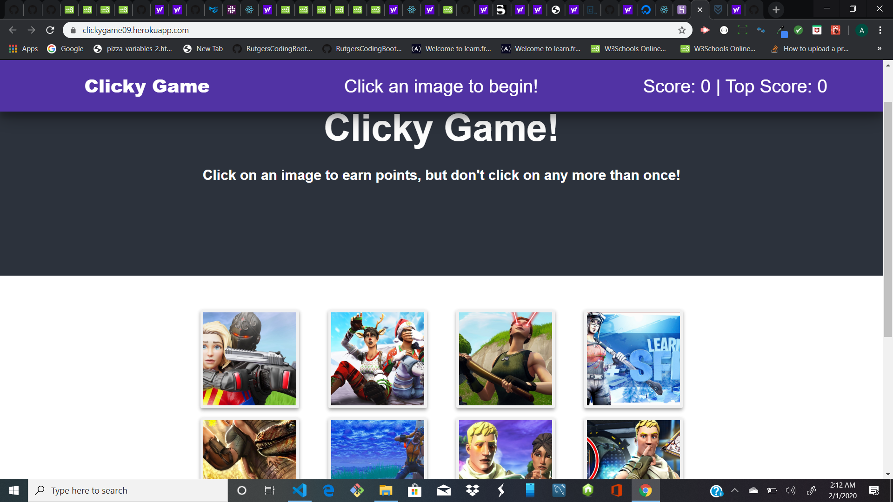

# Clicky-Game
This is memory game created with React. The app is done by breaking up my application's UI into components, then manage component state to respond to user events.

View the live app @: https://clickygame09.herokuapp.com/

# Overview
1. This react web app creates a memory game.

2. This application renders different images to the screen.

3. Each image listens for click events.

4. The application then keeps track of the user's score.

5. The user's score is increse when the user clicks on an image for the first time.

6. The user's score is reset after an incorrect guess, this made the game to restart.
